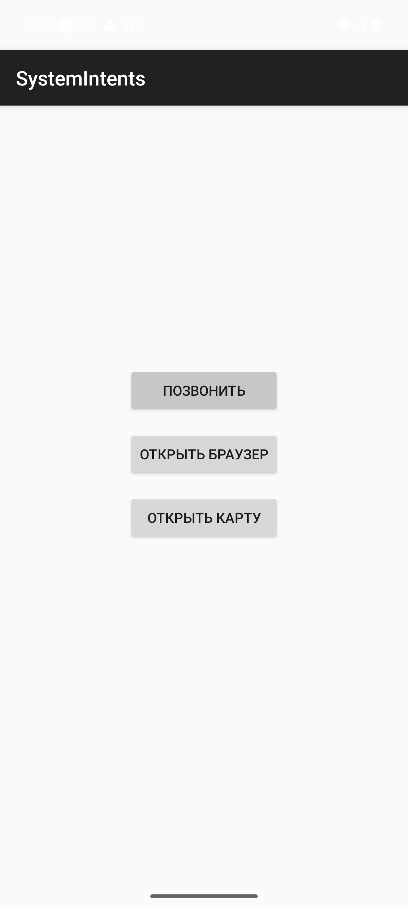
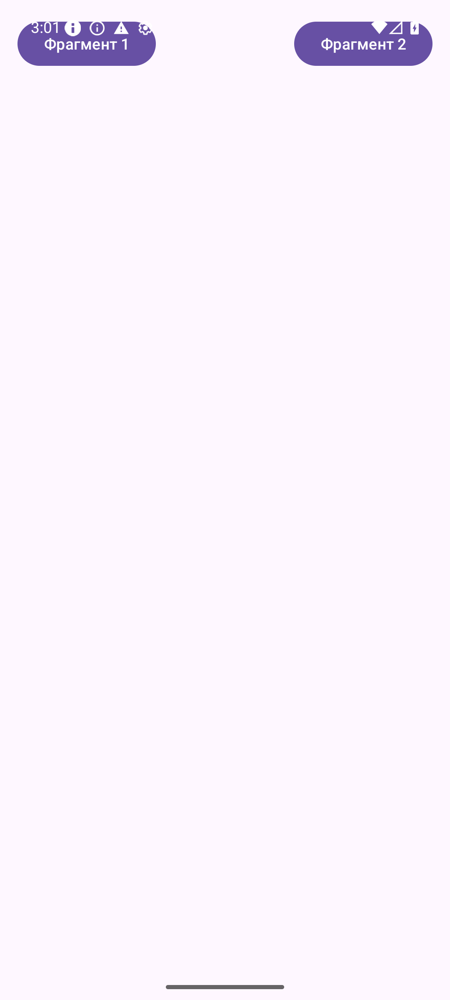

# Отчет по выполнению практической работы №3

### Автор: Фёдоров Антон Сергеевич
### Группа: БСБО-09-23

---

## Цель работы

Целью данной работы являлось изучение механизмов взаимодействия между компонентами приложения с помощью `Intent`, освоение передачи данных и получения результата из активностей, изучение жизненного цикла и механизмов работы с `Fragments`, а также реализация сложного интерфейса с использованием `Navigation Drawer` и `Navigation Component`.

## Структура проекта

Работа выполнена в рамках единого проекта `Lesson3`, состоящего из нескольких независимых модулей, каждый из которых решает отдельную учебную задачу:

-   **`IntentApp`**: Передача данных (системное время и расчет значения) между Activity.
-   **`FavoriteBook`**: Получение результата из дочерней Activity с использованием `ActivityResultLauncher`.
-   **`SystemIntentsApp`**: Вызов системных приложений (телефон, браузер, карты) через неявные намерения.
-   **`SimpleFragmentApp`**: Работа с фрагментами и реализация адаптивного интерфейса (Landscape/Portrait).
-   **`MireaProject`**: Контрольное задание — приложение с боковым меню, навигационным графом и WebView.

---

## Выполненные задания

### Задание 1. Передача данных между Activity (модуль `IntentApp`)

**Задача:** Реализовать передачу системного времени из первой активности во вторую. Во второй активности вывести строку, содержащую квадрат своего номера по списку (Вариант 24).

**Код передачи данных в `MainActivity.java`:**
```java
public void onClickSendTime(View view) {
    long dateInMillis = System.currentTimeMillis();
    String format = "yyyy-MM-dd HH:mm:ss";
    final SimpleDateFormat sdf = new SimpleDateFormat(format);
    String dateString = sdf.format(new Date(dateInMillis));

    Intent intent = new Intent(this, SecondActivity.class);
    intent.putExtra("date_time", dateString);
    startActivity(intent);
}
```
**Код вывода данных в `SecondActivity.java` (Вариант 24):**
```java
String time = getIntent().getStringExtra("date_time");
String message = "КВАДРАТ ЗНАЧЕНИЯ МОЕГО НОМЕРА ПО СПИСКУ В ГРУППЕ СОСТАВЛЯЕТ 576, а текущее время " + time;
textView.setText(message);
```

### Задание 2. Получение результата из Activity (модуль `FavoriteBook`)

**Задача:** Реализовать передачу данных во вторую активность и возврат введенного пользователем значения в первую с использованием `ActivityResultLauncher`.

**Логика работы в `MainActivity.java`:**
```java
activityResultLauncher = registerForActivityResult(
    new ActivityResultContracts.StartActivityForResult(),
    result -> {
        if (result.getResultCode() == Activity.RESULT_OK) {
            Intent data = result.getData();
            String userBook = data.getStringExtra("MESSAGE");
            textViewUserBook.setText("Название Вашей любимой книги: " + userBook);
        }
    }
);
```

### Задание 3. Вызов системных интентов (модуль `SystemIntentsApp`)

**Задача:** Реализовать вызов стандартных приложений Android для выполнения действий: звонок, открытие веб-страницы и отображение координат на карте.

**Код методов в `MainActivity.java`:**
```java
public void onClickCall(View view) {
    Intent intent = new Intent(Intent.ACTION_DIAL);
    intent.setData(Uri.parse("tel:89811112233"));
    startActivity(intent);
}

public void onClickOpenBrowser(View view) {
    Intent intent = new Intent(Intent.ACTION_VIEW);
    intent.setData(Uri.parse("http://developer.android.com"));
    startActivity(intent);
}
```

### Задание 4. Работа с фрагментами (модуль `SimpleFragmentApp`)

**Задача:** Изучить работу `FragmentManager`. Реализовать смену фрагментов по кнопкам в портретном режиме и их одновременное отображение в ландшафтном режиме.

**Код смены фрагмента в `MainActivity.java`:**
```java
public void onClick(View view) {
    if (findViewById(R.id.fragmentContainer) != null) {
        if (view.getId() == R.id.btnFragment1) {
            fragmentManager.beginTransaction().replace(R.id.fragmentContainer, fragment1).commit();
        } else if (view.getId() == R.id.btnFragment2) {
            fragmentManager.beginTransaction().replace(R.id.fragmentContainer, fragment2).commit();
        }
    }
}
```

### Задание 5. Контрольное задание (модуль `MireaProject`)

**Задача:** Создать проект с `Navigation Drawer`. Реализовать фрагмент с информацией по варианту (Кибербезопасность) и фрагмент со встроенным `WebView`.

**Код инициализации Navigation в `MainActivity.java`:**
```java
mAppBarConfiguration = new AppBarConfiguration.Builder(
        R.id.nav_data, R.id.nav_webview)
        .setOpenableLayout(drawer)
        .build();
NavController navController = Navigation.findNavController(this, R.id.nav_host_fragment_content_main);
NavigationUI.setupActionBarWithNavController(this, navController, mAppBarConfiguration);
NavigationUI.setupWithNavController(navigationView, navController);
```

---

## Скриншоты






---

## Выводы

В ходе выполнения данной работы были освоены следующие фундаментальные концепции Android-разработки:

-   **Механизм Intent:** Изучены способы явного вызова компонентов приложения и использования неявных намерений для взаимодействия с системными сервисами ОС Android.
-   **Обработка результатов:** Освоен современный интерфейс `ActivityResultLauncher` для получения данных от запущенных активностей.
-   **Фрагменты (Fragments):** Получен опыт создания динамических интерфейсов. Изучена разница между статической и динамической установкой фрагментов, а также управление ими через `FragmentManager`.
-   **Адаптивная верстка:** Реализованы различные макеты для портретной и альбомной ориентации с использованием квалификаторов ресурсов (`layout-land`).
-   **Navigation Component:** Реализована современная архитектура навигации в приложении с использованием `NavGraph`, `NavController` и `Navigation Drawer`.
-   **View Binding:** Получен практический опыт использования `View Binding` для безопасного взаимодействия с иерархией представлений из кода.