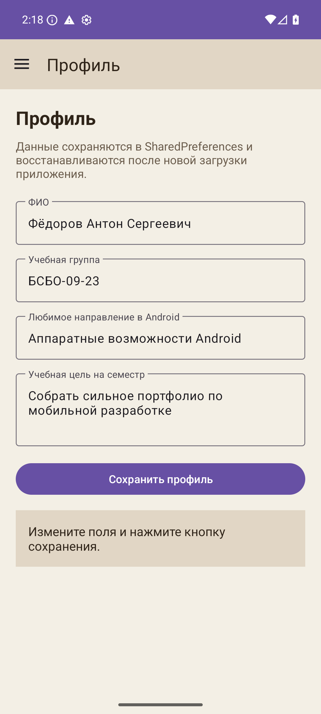
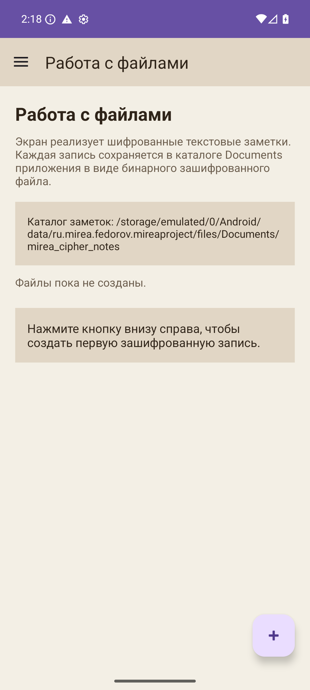

# Отчет по выполнению практической работы №6

### Автор: Фёдоров Антон Сергеевич
### Группа: БСБО-09-23

---

## Цель работы

Целью данной работы являлось изучение современных средств выполнения фоновых задач в Android, освоение компонентов `WorkManager` и `Service`, а также определение различий между одноразовыми, периодическими и длительно работающими фоновыми задачами.

## Структура работы

Практическая работа №6 включает следующие темы:

- **WorkManager:** постановка и выполнение фоновых задач;
- **Worker:** описание логики фоновой операции;
- **WorkRequest:** конфигурация одноразовых и периодических задач;
- **Service:** длительно работающий фоновый компонент Android;
- **Жизненный цикл сервиса:** запуск, выполнение и остановка.

---

## Выполненные задания

### Задание 1. Изучение `WorkManager`

**Задача:** Рассмотреть архитектуру `WorkManager` и основные классы, используемые для фоновых задач.

В ходе выполнения работы были изучены следующие компоненты:

- `WorkManager`;
- `Worker`;
- `WorkRequest`;
- `OneTimeWorkRequest`;
- `PeriodicWorkRequest`;
- `WorkInfo`.

Было установлено, что `WorkManager` является рекомендуемым механизмом для выполнения отложенных фоновых задач вне UI-потока.

### Задание 2. Создание собственного `Worker`

**Задача:** Реализовать фоновую задачу, выполняемую в отдельном рабочем потоке.

**Пример кода:**

```java
public class UploadWorker extends Worker {
    public UploadWorker(@NonNull Context context,
                        @NonNull WorkerParameters params) {
        super(context, params);
    }

    @NonNull
    @Override
    public Result doWork() {
        Log.d("UploadWorker", "doWork: start");
        try {
            Thread.sleep(5000);
        } catch (InterruptedException e) {
            e.printStackTrace();
        }
        Log.d("UploadWorker", "doWork: end");
        return Result.success();
    }
}
```

### Задание 3. Постановка задачи в очередь

**Задача:** Запустить фоновую работу через `WorkManager`.

**Пример кода:**

```java
WorkRequest uploadWorkRequest =
        new OneTimeWorkRequest.Builder(UploadWorker.class).build();

WorkManager.getInstance(this).enqueue(uploadWorkRequest);
```

Данный подход позволяет системе самостоятельно выбрать подходящий момент для запуска фоновой задачи.

### Задание 4. Изучение `Service`

**Задача:** Рассмотреть назначение сервиса и его жизненный цикл.

Были изучены методы:

- `onCreate()`;
- `onStartCommand()`;
- `onBind()`;
- `onDestroy()`.

Также были рассмотрены режимы возврата из `onStartCommand()`:

- `START_STICKY`;
- `START_NOT_STICKY`;
- `START_REDELIVER_INTENT`.

### Задание 5. Реализация собственного сервиса

**Задача:** Создать сервис и определить его обработку запуска и завершения.

**Пример кода:**

```java
public class MyService extends Service {
    @Override
    public void onCreate() {
        super.onCreate();
        Log.d("MyService", "onCreate");
    }

    @Override
    public int onStartCommand(Intent intent, int flags, int startId) {
        Log.d("MyService", "onStartCommand");
        return START_STICKY;
    }

    @Override
    public void onDestroy() {
        super.onDestroy();
        Log.d("MyService", "onDestroy");
    }

    @Override
    public IBinder onBind(Intent intent) {
        return null;
    }
}
```

### Задание 6. Сравнение `WorkManager` и `Service`

**Задача:** Определить, в каких случаях применяется каждый из механизмов.

В результате сравнения было установлено:

- `WorkManager` подходит для гарантированного выполнения фоновых задач, не требующих постоянной активности;
- `Service` подходит для длительных операций, которые должны продолжаться независимо от пользовательского интерфейса, например проигрывание музыки или длительный мониторинг.

---

## Скриншоты





---

## Выводы

В ходе выполнения практической работы №6 были изучены современные и классические механизмы фоновой работы в Android. Были освоены `Worker`, `WorkManager`, `WorkRequest` и `Service`. Полученные знания позволяют выбирать корректный способ выполнения фоновой задачи в зависимости от её длительности, требований к жизненному циклу и необходимости взаимодействия с системой.
