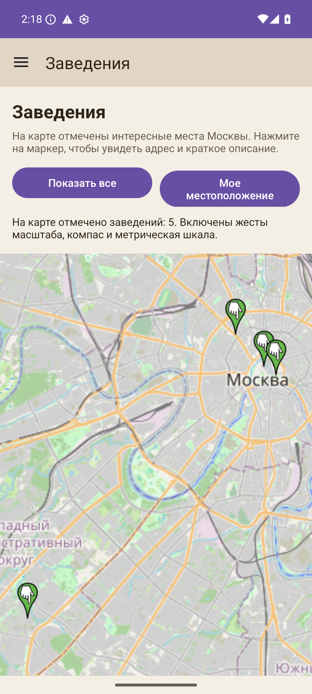
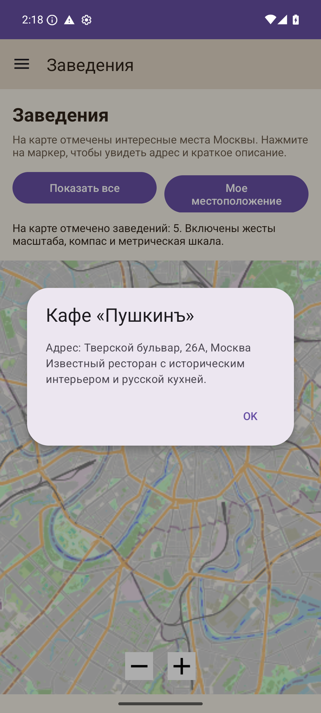

# Отчет по выполнению практической работы №8

### Автор: Фёдоров Антон Сергеевич
### Группа: БСБО-09-23

---

## Тема

Картографические сервисы в Android.

## Цель работы

Целью практической работы являлось изучение картографических сервисов и добавление в проект `MireaProject` экрана с заведениями, их описаниями и возможностью отображения на карте.

---

## Выполненные задания

### 1. Выбор картографического сервиса

Для контрольного задания выбран `OpenStreetMap` через библиотеку `osmdroid`. Этот вариант не требует персонального API-ключа и подходит для учебного проекта.

### 2. Экран «Заведения»

В проект добавлен `EstablishmentsFragment`, который подключен к боковому меню приложения. В разметке `fragment_establishments.xml` размещена карта `org.osmdroid.views.MapView`, панель с описанием экрана и кнопки управления.

### 3. Маркеры на карте

На карте отмечены несколько заведений и интересных мест Москвы:

- `РТУ МИРЭА`;
- `Кафе «Пушкинъ»`;
- `ГУМ`;
- `Парк «Зарядье»`;
- `ВДНХ`.

При нажатии на маркер открывается диалог с адресом и кратким описанием заведения.

### 4. Дополнительная функция карты

В качестве дополнительной функции реализовано определение текущего местоположения пользователя. При нажатии на кнопку `Мое местоположение` приложение проверяет разрешения `ACCESS_FINE_LOCATION` и `ACCESS_COARSE_LOCATION`, затем включает слой `MyLocationNewOverlay`.

Дополнительно на карту добавлены компас, метрическая шкала масштаба, жесты и кнопки масштабирования.

---

## Скриншоты

---

## Выводы

В ходе практической работы №8 был изучен принцип интеграции картографического сервиса в Android-приложение. В проект добавлен экран с OpenStreetMap-картой, маркерами заведений, описаниями, адресами и функцией определения текущего местоположения пользователя.
